# **Traffic Sign Recognition** 

**Build a Traffic Sign Recognition Project**

The goals / steps of this project are the following:
* Load the data set (see below for links to the project data set)
* Explore, summarize and visualize the data set
* Design, train and test a model architecture
* Use the model to make predictions on new images
* Analyze the softmax probabilities of the new images
* Summarize the results with a written report

---

### Data Set Summary & Exploration

I used the pandas and numpy to analyze the data set.

* The size of training set is 34799
* The size of the validation set is 4410
* The size of test set is 12630
* The shape of a traffic sign image is (32, 32, 3)
* The number of unique classes/labels in the data set is 43

Below are the distributions of train, val and test dataset:

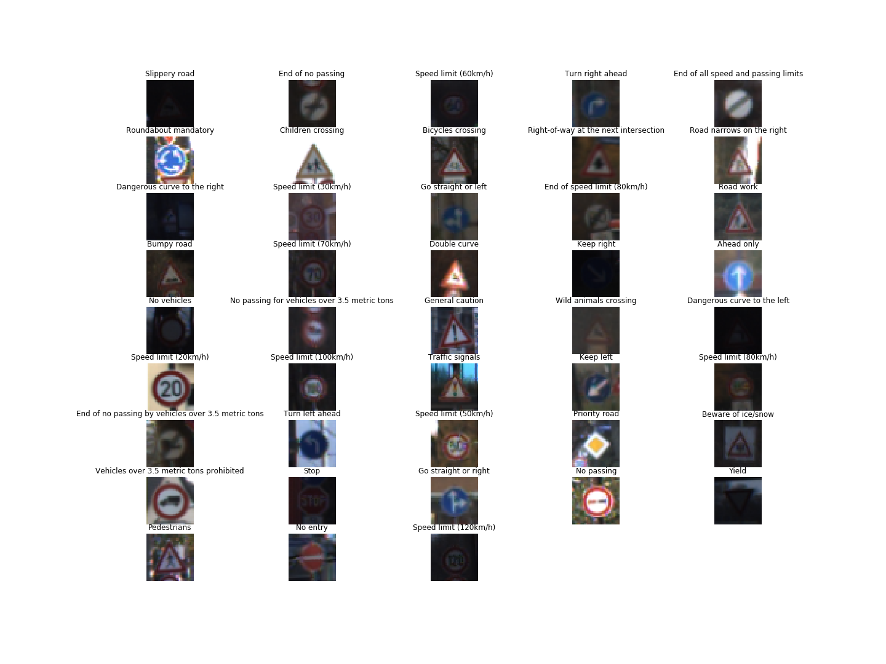

*Examples of each class*

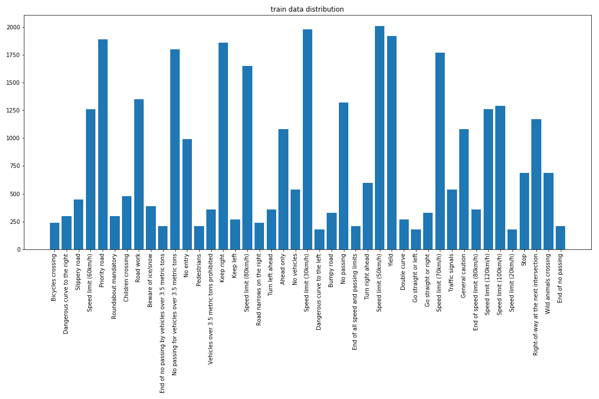

*Distribution of training dataset*

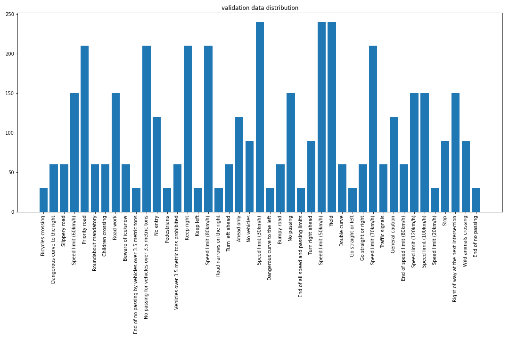

*Distribution of validation dataset*

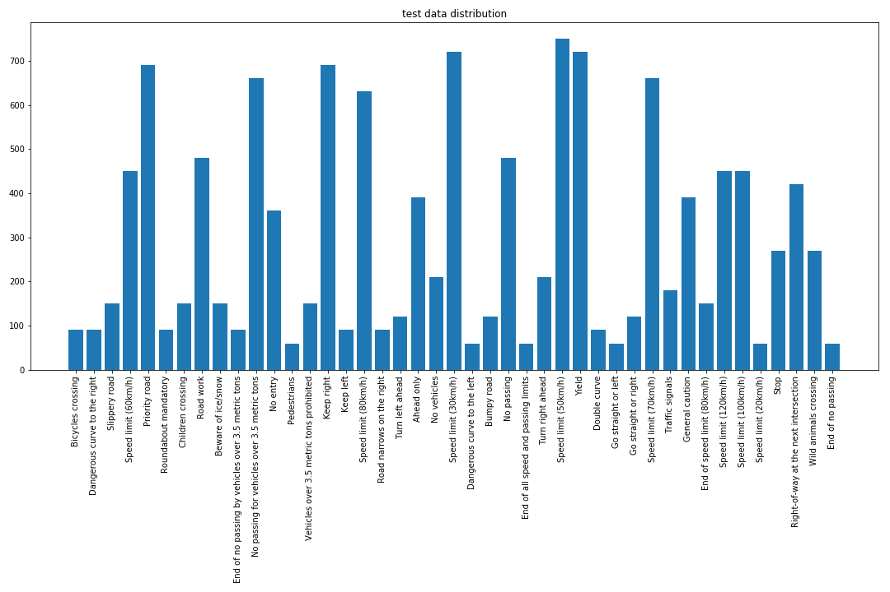

*Distribution of test dataset*

### Design and Test a Model Architecture

#### Data Normalization

I tested several ways of data normalization including transfer images into range of `-0.5` to `0.5`, range of `0` to `1`, zero mean equal standard deviation and grayscale. 

I compared the performances with different methods of data normalization and show the validation accuracy during training based on LeNet below:

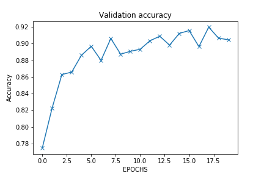

*Grayscale input (accuracy around 92%)*

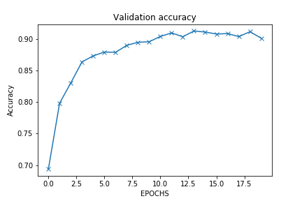

*Transfer images into range of 0 to 1 (accuracy around 90%)*

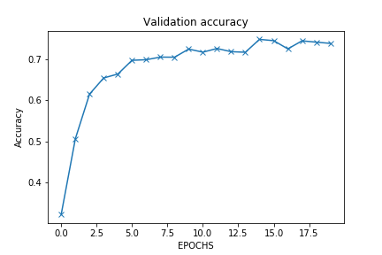

*Transfer images into range of -0.5 to 0.5 (accuracy around 75%)*

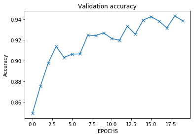

*Rescale the images by zero mean and equal standard deviation (accuracy around 93%)*

So I use the method of zero mean and equal standard deviation to normalize the images. 

### Training hyperparameters

* Batch size: 128
* Number of epochs trained: 20
* Type of optimizer: Adam `tf.train.AdamOptimizer`
* Learning rate: 0.001

Then, based on those training hyperparameters, I saved the model which gets **Validation Accuracy = 0.936** on the validation dataset. 

Besides, I tried to exploit the cross entropy loss with weights, which is to deal with the imbalanced dataset. At first I calculate the [median frequence](https://blog.node.us.com/tensorflow-dealing-with-imbalanced-data-eb0108b10701) of each class and use 
`tf.losses.softmax_cross_entropy` with the corresponding weights according to the classes selected in each batch. Below is the result of LeNet with weighted loss:

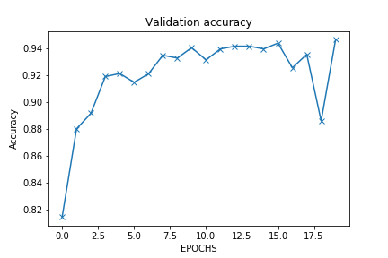

*LeNet with weighted loss (accuracy around 94%)*

Then, based on the saved model, I evaluate its performance of the test dataset and got **Test Accuracy = 0.928**. Below is the confusion matrix of each class on the test dataset (for the drawing, please see the [codes](https://github.com/wcipriano/pretty-print-confusion-matrix)):

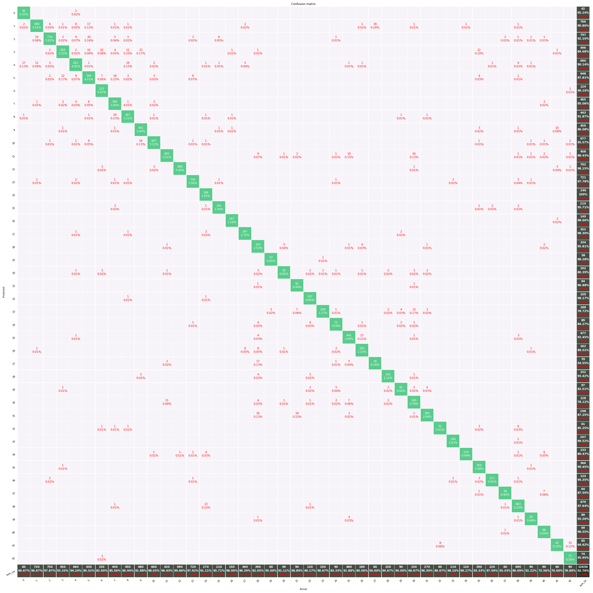

*Confusion matrix of test dataset based on the trained LeNet*

For further testing the performance on the web images, I downloaded five traffic sign images shown as:

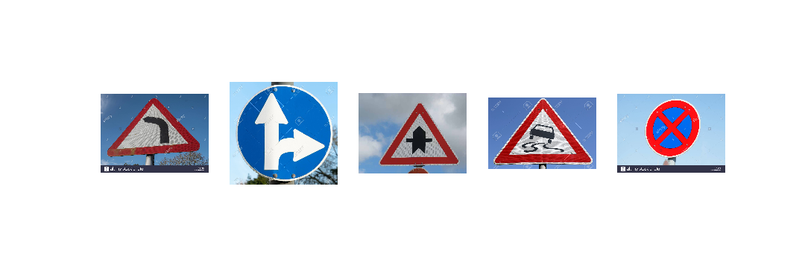

*Downloaded test images from website*

Based on the saved LeNet model, the inference results are displayed as:
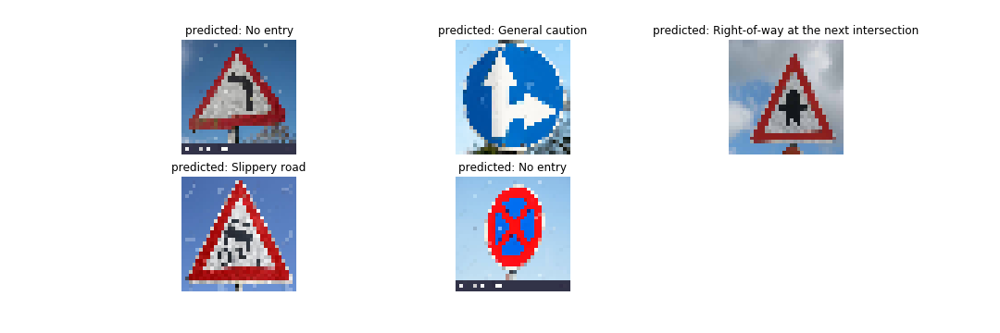

*Classified result based on the trained LeNet model*

It can be seen that 3 out of 5 are correctly classified. 

Further, I demonstrated the top 5 predicted classes with the probabilities of those images as:
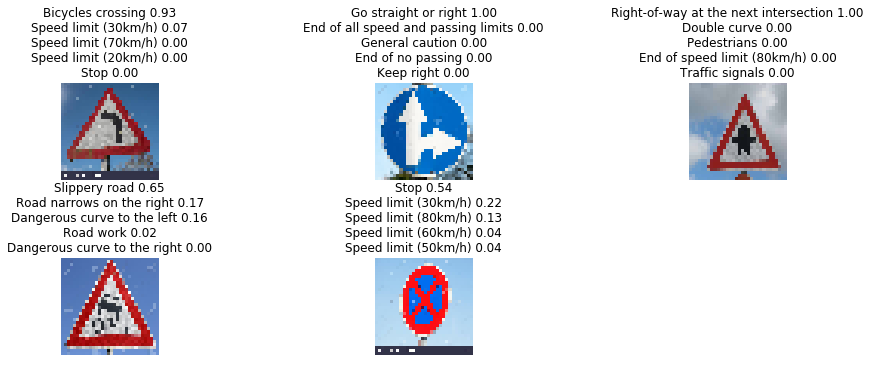

*Classified result of top 5 classes based on the trained LeNet model*

### Discussion about the performance on the downloaded images
As we can see that, since the original downloaded images from website are of big size, after resizing to `(32x32x3)`, the symbols inside the sign cannot be seen very clearly in the image, e.g. slippery road. This can be one reason which influences the performance of the network. Another reason is that there is other information such as copyright characters in the orginal images, which can be condisered as noise, and also influence the classification. 

As comparing with the performance of the provided test images, the accuracy of downloaded 5 images is lower than that (`0.6` vs `0.928`). The reason is that the generalizaiton capability of the network on the website images is lower than the test images collected from the same domain as the train and validation images. 

### Feature map demonstration

In order to obtain the intuition that what the network learnt, I got the feature maps of the first Conv2D layer as:
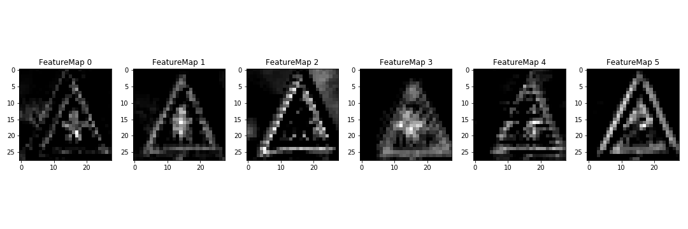

*Feature maps of the first Conv2D layer of the trained network on one image from website*

As we can see, the active region is the borders of the traffic sign and the symbol inside it.

---

## Improve the architecture

Next, I would like to improve the architecture for learning a more powerful feature for the traffic sign classification. Since I run the training on my laptop with the GPU GeForce GTX 960M, I should not use big network architectures. 

Inspired from the utilized network in [blog](https://chatbotslife.com/german-sign-classification-using-deep-learning-neural-networks-98-8-solution-d05656bf51ad), I modified a little bit and achieved the performance of validation accuracy with **98.6%** and test accuracy with **97.2%**. Note that the training is **without any data augmentation**. 

There are two modifications, the first one is dimension reduction of each scale of features to the same size (`128`) of embedded feature, and then concatenate them as a feature which combines each level of feature maps. In this way, the combined feature is just with the size `3*128=384`, which is far more less parameters than [this](https://chatbotslife.com/german-sign-classification-using-deep-learning-neural-networks-98-8-solution-d05656bf51ad).  The second one is further reduction of the number of parameters of the last 2 fully connected layers, which are `256` and `128`, respectively. 

Based on that, this network can be handled for training on my laptop. 

Below are some results to display:

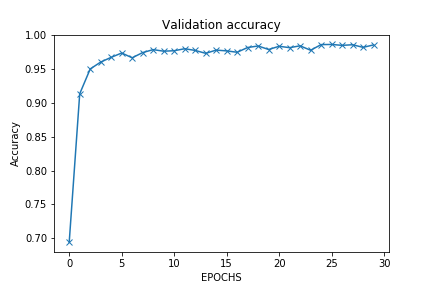

*Validation accuracy during training SinNet*

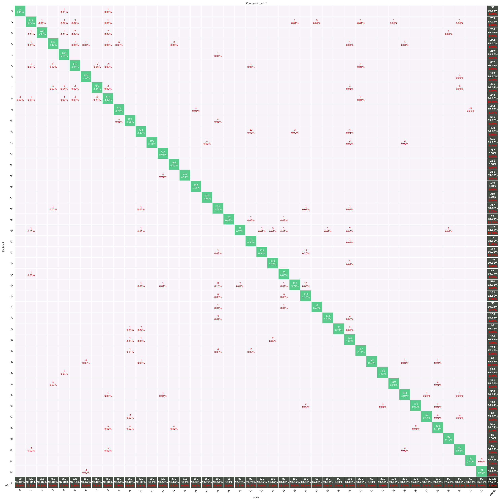

*Confusion matrix of SinNet on the test dataset*

My final model (SinNet) consisted of the following layers:

| Layer         		|     Description	        					| 
|:---------------------:|:---------------------------------------------:| 
| Input   X      		| 32x32x3 RGB image   							| 
| Convolution 1x1   	| 1x1 stride, same padding, outputs 32x32x3 	|
| Convolution 3x3       | 1x1 stride, valid padding, outputs 30x30x32   |
| RELU					|												|
| Convolution 3x3       | 1x1 stride, valid padding, outputs 28x28x32   |
| RELU					|												|
| Max pooling	      	| 2x2 stride,  outputs 14x14x32 				|
| Dropout	=>  X      	| 0.5                            				|
| Dimension reduction	=>  X_1 	| 6272=>128            				|
| X => Convolution 3x3	| 1x1 stride,  valid padding, outputs 12x12x64 				|
| RELU					|												|
| Max pooling	      	| 2x2 stride,  outputs 6x6x64 				|
| Dropout	=>  X      	| 0.5                            				|
| Dimension reduction	=>  X_2 	| 2304=>128            				|
| X => Convolution 3x3  | 1x1 stride, valid padding, outputs 4x4x128    |
| RELU					|												|
| Dropout	=>  X      	| 0.5                            				|
| Dimension reduction	=>  X_3 	| 2048=>128            				|
| Concatenate(X_1, X_2, X_3) | 384 |
| Fully connected		| 384=>256    									|
| Fully connected		| 256=>128    									|
| Fully connected		| 128=>43    									|
| Softmax				| 43          									|
| | |

### Summary
1. Combining the different level of features can be helpful for the network classification. 
2. A linear transformation of input image with 1x1x3x3 Conv2D kernel may learn a proper color space for the classification. 
3. Data augmentation and other training tricks, such as learning rate decay, may further improve the performance of SinNet.

